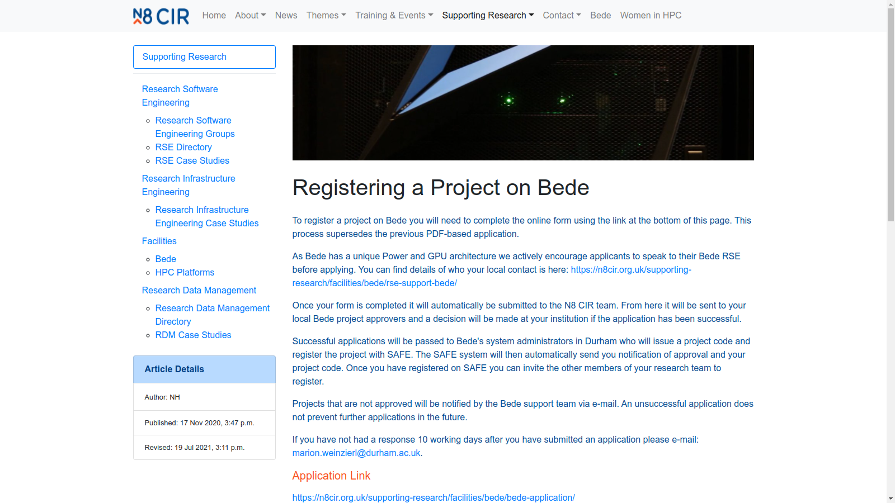
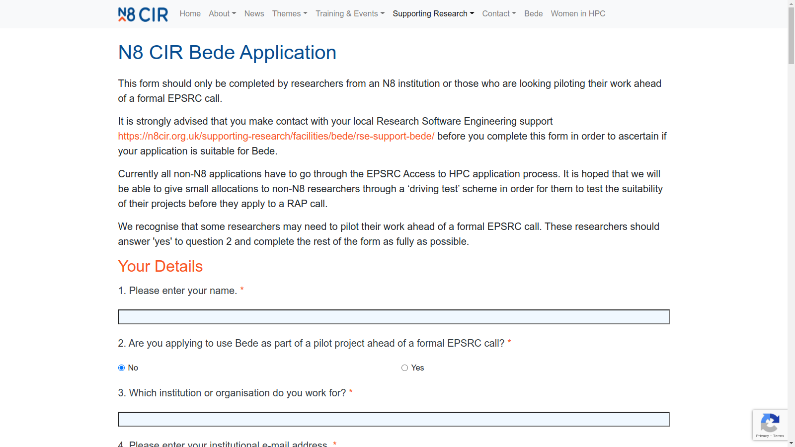
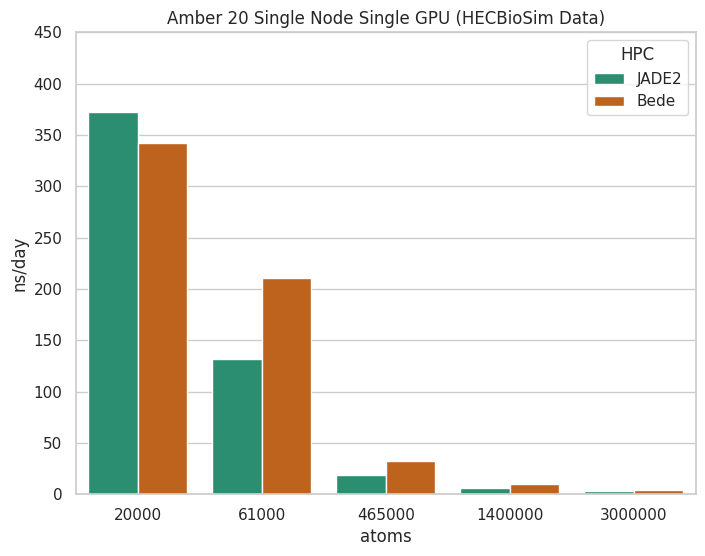

<!-- markdownlint-disable MD025 -->
<!-- markdownlint-disable MD026 -->
<!-- markdownlint-disable MD033 -->
<!-- markdownlint-disable MD035 -->
<!-- markdownlint-disable MD036 -->

<style type="text/css">
.logo-grid-ish img {
  height: 140px;
  margin: 32px;
}
.logo-grid-ish img.very-faded {
  opacity: 0.05;
}

.reveal pre.code-wrapper {
  width: 55%;
  margin: 64px auto;
}
.reveal pre.code-wrapper > code {
  padding: 2rem;
  font-size: 2rem;
  line-height: 2.1rem;
  max-height: 800px;
}

div.three-col {
  display: flex;
  flex-wrap: wrap;
}

div.three-col > .one-third {
  flex-grow: 1;
  width: 33%;
}
.reveal div.three-col pre.code-wrapper {
  width: 95%;
  margin: 16px auto;
}

div.three-col > .one-third h3 {
  font-size: 2.5rem;
}

.reveal h2, .reveal h3, .reveal h4 {
  text-transform: none;
}

.reveal h2 {
  font-size: 1.8em;
}

.reveal .bigger-content p {
  font-size: 3.6rem;
}

img.web-screenshot {
  width: 1600px;
  height: 900px;
  margin: 0px auto;
}

.reveal p {
  margin: 16px 0;
}

</style>

# HPC Beyond Sheffield:

# JADE and Bede

<br />

Peter Heywood

Research Software Engineer

[ <!-- .element: style="vertical-align:middle; height:48px;" --> github.com/ptheywood](https://github.com/ptheywood)

note:

Overview.

* Tier 2 HPC Overview
* JADE
* Bede
* Which HPC Resource Should I Use?
* Accessing Tier 2 HPC Resources
* Using Tier 2 HPC

---

## Overview

<!-- .slide: data-visibility="hidden" -->

* Tier 2 HPC Overview
* JADE
* Bede
* Which HPC Resource Should I Use?
* Accessing Tier 2 HPC Resources
* Using Tier 2 HPC

---

## UK HPC Tiers

<!-- .slide: data-background="#ffffff" -->


[Source: epsrc.ukri.org/files/research/tier2hpcstrategy](https://epsrc.ukri.org/files/research/tier2hpcstrategy/)

note: T3 local like ShARC and Bessemer
T2 are regional systems, usually larger or specialised
T1 are national scale, very large systems
T0 are international

----

## UK Tier 2 HPC

<!-- .slide: data-background="#ffffff" -->
<!-- .slide: data-transition="slide-in fade-out" -->
<!-- .slide: class="logo-grid-ish" -->


[hpc-uk.ac.uk/facilities/](https://www.hpc-uk.ac.uk/facilities/)

note: These are some of the Tier-2 facilities in the UK

as listed on the hpc-uk.ac.uk website

Most of these can be accessed if appropriate

----

## UK Tier 2 HPC

<!-- .slide: data-background="#ffffff" -->
<!-- .slide: data-transition="fade-in" -->
<!-- .slide: class="logo-grid-ish" -->

 <!-- .element: class="very-faded"-->
 <!-- .element: class="very-faded"-->
 <!-- .element: class="very-faded"-->

 <!-- .element: class="very-faded" -->

 <!-- .element: class="very-faded"-->

 <!-- .element: class="very-faded"-->

 <!-- .element: class="very-faded"-->

[hpc-uk.ac.uk/facilities/](https://www.hpc-uk.ac.uk/facilities/)

note: But at sheffield we have more-direct access to the JADE and Bede systems

Which are free at the point of use, and open to all departments, as long as your project fits certain criteria

---

<!-- .slide: data-background="#ffffff" -->


[www.jade.ac.uk](https://www.jade.ac.uk)

----

## JADE

*Joint Academic Data Science Endeavour*

Machine Learning and Molecular Dynamics

NVIDIA’s DGX-MAX-Q Deep Learning System

<br />

[Funded by EPSRC Grant EP/T022205/1](https://gow.epsrc.ukri.org/NGBOViewGrant.aspx?GrantRef=EP/T022205/1)

Consortium led by Oxford University

**Free at point-of-use and open to all departments!**

----

## JADE

<!-- .slide: data-background="./assets/img/thirdparty/nvidia-dgx-exploded.jpg" -->
<!-- .slide: data-background-opacity="0.1" -->

63 Nodes

2 CPUs per node (20 cores each)

8 NVIDIA V100 Max-Q GPUs per node with NVLink

4 TB of SSD per node

Up to 8 GPUs per Job

----

## JADE

<iframe src="http://www.jade.ac.uk/" height="900" width="1600"></iframe>

[www.jade.ac.uk](https://www.jade.ac.uk/)

----

## JADE

<iframe src="http://docs.jade.ac.uk/" height="900" width="1600"></iframe>

[docs.jade.ac.uk](https://docs.jade.ac.uk/)

---

<!-- ## Bede -->

<!-- .slide: data-background="#ffffff" -->


[n8cir.org.uk/bede](n8cir.org.uk/bede/)

----

## Bede

Any GPU workload

IBM Power System AC922 & IC922

**Power 9 architecture is unique within UK Tier 2 HPC**

<br />

[Funded by EPSRC Grant EP/T022167/1](https://gow.epsrc.ukri.org/NGBOViewGrant.aspx?GrantRef=EP/T022167/1)

N8 Centre of Excellence in Computationally Intensive Research (N8 CIR)

**Free at point-of-use and open to all departments!**

----

## Bede

**32 nodes with:**

2 POWER9 CPUs per node, with NVLink

4 NVIDIA Tesla V100 32G GPUs with NVLink

512 GB DDR4 RAM

<br />

**4 nodes with:**

2 POWER9 CPUs per node

4 NVIDIA Tesla T4 GPUs

256GB DDR4

<br />

**Multi-node jobs are supported**

----

## Bede

**Well-suited for:**

Large problems requiring many GPUs (multiple nodes)

Large volumes of CPU-GPU data movement (NVLink)

<br />

**However:**

Not all applications are POWER9 compatible

i.e no MATLAB

----

## Bede

 <!-- .element: class="web-screenshot" -->

[n8cir.org.uk/bede](https://n8cir.org.uk/bede/)

----

## Bede

<iframe src="https://bede-documentation.readthedocs.io" height="900" width="1600"></iframe>

[bede-documentation.readthedocs.io](https://bede-documentation.readthedocs.io)

---

## Which GPU HPC Resource Should I Use?

Note: When deciding which HPC resource is most appropriate, there are several things to consider.

----

## Are my jobs allowed on the system?

| Domain                 | JADE     | Bede     |     TUoS |
|------------------------|:--------:|:--------:|:--------:|
| **Machine Learning**   | &#10003; | &#10003; | &#10003; |
| **Molecular Dynamics** | &#10003; | &#10003; | &#10003; |
| **Other**              | &#10008; | &#10003; | &#10003; |

Note: Is my workload allowed on the cluster?

For Bede and the local Tier 3 systems, any problem domain is allowed

While JADE is limited to Machine Learning and Molecular Dynamics applications, although this will include a significant number of GPU workloads.

----

## How many GPUs can I use at once?

| Scale                           | JADE     | Bede     | TUoS                                  |
|---------------------------------|:--------:|:--------:|:-------------------------------------:|
| **CPU-only**                    | &#10008; | &#10008; | &#10003;<sup><code>&nbsp</code></sup> |
| **Single-GPU**                  | &#10003; | &#10003; | &#10003;<sup><code>&nbsp</code></sup> |
| **Single-Node Multi-GPU**       | 8        | 4        | 4<sup><code>*</code></sup>            |
| **Multi-Node &nbsp; Multi-GPU** | &#10008; | &#10003; | &#10008;<sup><code>†</code></sup>     |

<br />
<br />
<small>* ShARC's K80 nodes contain 8 GPUs and private P100 node contains 7 GPUs. </small>

<br />
<small>† ShARC's K80 nodes support multi-node. Bessemer's V100 nodes do not.</small>

Note: How many GPUs do my jobs need or benefit from?

If you do not need GPUs, then neither of the easy-access T2 systems are appropriate.

If you only need a single GPU or a few GPUs within a single node, you can use any of the systems

But if you need more than 4 modern GPUs, then JADE is appropriate up to 8, or you could use Bede for multi-node jobs.

----

## Which system has the most GPUs?

| GPU Capacity        | JADE     | Bede                                | Bessemer | Private Bessemer* |
|---------------------|---------:|------------------------------------:|---------:|------------------:|
| **GPU Nodes**       |       63 |    38<sup><code>†</code></sup>      |        1 |                12 |
| **GPUs per Node**   |        8 |     4<sup><code>&nbsp;</code></sup> |        4 |                 4 |
| **Total GPUs**      |      504 |   152<sup><code>&nbsp;</code></sup> |        4 |                48 |
| **Maximum per Job** |        8 |   128<sup><code>‡</code></sup>      |        4 |                 4 |

<br />
<br />
<small>* Private GPUs may be available via preemptable jobs</small>

<br />
<small>† Includes 2 Interactive nodes, 32 V100 compute nodes and 4 T4 infer nodes</small>

<br />
<small>‡ Large multi-node jobs may queue for a <strong>very long</strong> time</small>

----

## Does data movement slow down my jobs? <!-- .element: class="r-fit-text" -->

| Data movement           | JADE     | Bede     | TUoS                                   |
|-------------------------|:--------:|:--------:|:--------------------------------------:|
| **GPU-GPU NVLink**      | &#10003; | &#10003; | &#65374;<sup><code>*</code></sup>      |
| **CPU-GPU NVLink**      | &#10008; | &#10003; | &#10008;<sup><code>&nbsp;</code></sup> |

<br />
<br />
<small>* Some UoS GPU nodes support GPU-GPU NVLink</small>

---

### Getting Access: JADE

<iframe src="https://docs.hpc.shef.ac.uk/en/latest/other-uk-hpc-resources/jade2.html" height="900" width="1600"></iframe>

[docs.hpc.shef.ac.uk/other-uk-hpc-resources/jade2.html](https://docs.hpc.shef.ac.uk/en/latest/other-uk-hpc-resources/jade2.html)

----

### Getting Access: JADE

<iframe src="https://bit.ly/jade2-access" height="900" width="1600"></iframe>

[bit.ly/jade2-access](https://bit.ly/jade2-access)

Note: A member of the RSE team (probably Twin) will then be in touch.

----

### Getting Access: JADE

<iframe src="https://www.jade.ac.uk/access/" height="900" width="1600"></iframe>

[www.jade.ac.uk/access](https://www.jade.ac.uk/access/)

Note: More information can be found on the jade.ac.uk website

----

<!-- ### Getting Access: JADE -->

tier-2-hpc-support-group@sheffield.ac.uk <!-- .element: class="r-fit-text" -->

note: If in doubt, get in touch.

---

### Getting Access: Bede

<iframe src="https://docs.hpc.shef.ac.uk/en/latest/other-uk-hpc-resources/bede.html" height="900" width="1600"></iframe>

[docs.hpc.shef.ac.uk/en/latest/other-uk-hpc-resources/bede.html](https://docs.hpc.shef.ac.uk/en/latest/other-uk-hpc-resources/bede.html)

----

### Getting Access: Bede

 <!-- .element: class="web-screenshot" -->

[n8cir.org.uk/supporting-research/facilities/bede/docs/bede_registrations](https://n8cir.org.uk/supporting-research/facilities/bede/docs/bede_registrations/)

Note: Bede - fill in the form, get in touch if needed. Some restrictions.

----

### Getting Access: Bede

<!-- <iframe src="https://n8cir.org.uk/supporting-research/facilities/bede/bede-application/" height="900" width="1600"></iframe> -->

 <!-- .element: class="web-screenshot" -->

[n8cir.org.uk/supporting-research/facilities/bede/bede-application](https://n8cir.org.uk/supporting-research/facilities/bede/bede-application/)

Note: Bede - fill in the form, get in touch if needed. Some restrictions.

This is a relatively thorough form, get in touch with us if you need any help.

----

tier-2-hpc-support-group@sheffield.ac.uk <!-- .element: class="r-fit-text" -->

note: If in doubt, get in touch.

---

### Getting Access: Other HPC facilities

<iframe src="https://docs.hpc.shef.ac.uk/en/latest/other-uk-hpc-resources.html" height="900" width="1600"></iframe>

[docs.hpc.shef.ac.uk/en/latest/other-uk-hpc-resources.html](https://docs.hpc.shef.ac.uk/en/latest/other-uk-hpc-resources.html)

note: If ShARC, Bessemer, Bede or Jade do not meet your needs, there are routes to gain access to other UK HPC facilities.

The first place to look is the "Other UK hpc resources" page of docs.hpc.shef.ac.uk website

----

### EPSRC Access to HPC Calls

<iframe src="https://www.ukri.org/opportunity/access-to-high-performance-computing/" height="900" width="1600"></iframe>

[ukri.org/opportunity/access-to-high-performance-computing](https://www.ukri.org/opportunity/access-to-high-performance-computing/)

note: EPRSC have been running calls for access ~ twice a year, for Tier 1 & Tier 2

---

## Using JADE and Bede

Note: Using the JADE and Bede is very similar to using Bessemer

----

## Using JADE and Bede: SSH

```bash
# JADE2
ssh USERNAME@jade2.hartree.stfc.ac.uk
```

```bash
# Bede
ssh USERNAME@login1.bede.dur.ac.uk
```

```bash
# Bessemer
ssh USERNAME@bessemer.shef.ac.uk
```

Note: All systems are connected to via ssh

----

## Using JADE and Bede: Module Environments

```bash
# List available modules
module avail

# Print module whatis information
module whatis <module>

# Load a module by name
module load <module>

# Remove / Unload a module 
module unload <module>

# List loaded modules
module list

# Show module details
module show <module>
```

[modules.readthedocs.io](https://modules.readthedocs.io/en/latest/)

----

## Using JADE and Bede: Slurm

```bash
# List queued jobs for $USER
squeue -u $USER
```

```bash
# Submit a batch job
sbatch job.sh
```

 <!-- .element: height="300px" style="background:#fff; padding: 40px;" -->

Note: The 3 systems all use Slurm for job scheduling, so commands are very similar

----

## Using JADE and Bede: Batch Jobs

<div class="three-col">

<div class="one-third">

### JADE

```slurm
#! /usr/bin/env bash

#SBATCH --partition=small


#SBATCH --time=12:00:00
#SBATCH --nodes=1
#SBATCH --gres=gpu:1


# Run commands
module load cuda
nvcc --version
```

</div>
<div class="one-third">

### Bede

```slurm
#! /usr/bin/env bash

#SBATCH --partition=gpu
#SBATCH --account=<project>

#SBATCH --time=12:00:00
#SBATCH --nodes=1
#SBATCH --gres=gpu:1


# Run commands
module load cuda
nvcc --version
```

</div>
<div class="one-third">

### Bessemer

```slurm
#! /usr/bin/env bash

#SBATCH --partition=gpu
#SBATCH --qos=gpu

#SBATCH --time=12:00:00
#SBATCH --nodes=1
#SBATCH --gpus-per-node=1
#SBATCH --cpus-per-gpu=10
#SBATCH --mem=48G

# Run commands
module load CUDA
nvcc --version
```

</div>
</div>

<br />

* `1` GPU
* `1/NGPUs` of the node's CPUs and memory
* 12 hour max runtime
* Loads the default CUDA module

Note: Batch jobs are the prefferred (or only) mechanism for running GPU jobs on the systems

In general, batch scripts will be very similar, but with small / subtle differences

----

## Using JADE and Bede: Containers

```bash
singularity exec path/to/image.sif exec <command>
```

  <!-- .element: height="300px" -->

<span>* Extra steps required for Bede due to PPC64LE CPU architecture</span>

---

## Next Steps

<!-- .slide: class="bigger-content" -->

<br />

[docs.hpc.shef.ac.uk](https://docs.hpc.shef.ac.uk/)

<br />

[tier-2-hpc-support-group@sheffield.ac.uk](mailto:tier-2-hpc-support-group@sheffield.ac.uk)

<br />

Book a Code Clinic:

[rse.shef.ac.uk/support/code-clinic](https://rse.shef.ac.uk/support/code-clinic)

<br />

 <!-- .element: height="180px;" style="margin-left: 0px; margin-right: 260px"-->
 <!-- .element: height="180px;" -->

note:

If you need to find any more information, head to the Sheffield HPC Documentation as a first point of call.

Alternatively, email tier-2-hpc-support-group@sheffield.ac.uk which will reach a member of the RSE group or IT Services.

You can also book a code-clinic session for a 1:1 chat about any programming problems, or advice on best practice or using HPC.

---

## Extra Slides

<!-- .slide: data-visibility="uncounted"--->

----

## HECBioSim Benchmarking

<!-- .slide: data-visibility="uncounted"--->
<!-- .slide: data-background="#fff"--->




[hecbiosim.ac.uk/access-hpc/benchmarks](https://www.hecbiosim.ac.uk/access-hpc/benchmarks)

<small>Data accessed 2022-02-17</small>

----

## How long can my jobs run for?

<!-- .slide: data-visibility="uncounted"--->

| Scale          | JADE               | Bede   | Bessemer   |
|----------------|:------------------:|:------:|:----------:|
| **Single-GPU** | 6 days             | 2 days | 7 days     |
| **Multi-GPU**  | 1 day&nbsp;&nbsp;  | 2 days | 7 days     |

<br />

Check-pointing can enable longer running experiments
